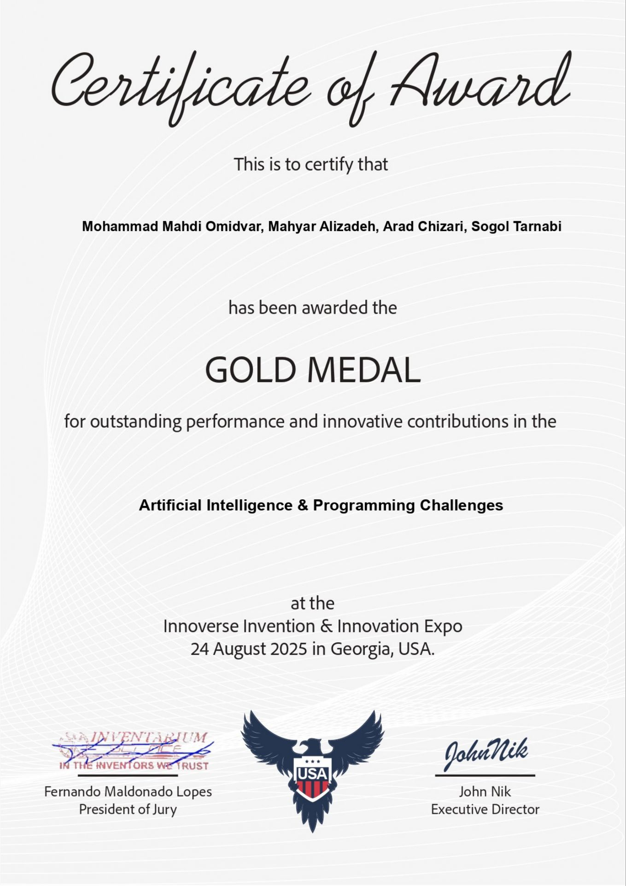

# 👋 Hi, I'm Mohammad Mahdi Omidvar (PyQubit)

💡 **AI Engineer & Specialist | Python, Web & AI Development**  
🏆 **Gold Medalist – INNOVERSE 2025 (AI Section)**

---

## 🔑 Skills

- **Machine Learning**  
- **Deep Learning**  
- **Reinforcement Learning**  
- **Computer Vision**  
- **Telegram Bot Development**  

---

## 🛠️ Skills & Tools

### 💻 Languages & Markup

### 🚀 Frameworks

### 📚 Libraries

### 💾 Databases

### ⚒️ Development Tools

---

## 🌟 Achievements

**Gold Medal – [INNOVERSE 2025](https://innoverse.world/)  AI Challenge**  
**Team (Iran):** Mohammad Mahdi Omidvar, Mahyar Alizadeh, Arad Chizari, Sogol Tarnabi  

---

## 🎓 Certificates

  
  
  
  
  

<ol>
  <li>Python Basics</li>
  <li>Advanced Python</li>
  <li>AI Algorithms</li>
  <li>Deep Learning</li>
  <li>Advanced API Programming</li>
</ol>

    

<o1>
<li>Artificial Intelligence & Programming Webinar</li>
</o1>

---

## 📌 Pin Projects

### 🏆 Innoverse-2025

**AI Emotion-to-Art Project** – Winner of Gold Medal in INNOVERSE 2025 (AI Section)  
This project converts user emotions (text, voice, and images) into symbolic AI-generated artworks.

**Key Features:**
- **Emotion Recognition:** Using Ollama (Gemma3:4b) to detect emotions from text, voice, and images  
- **Speech-to-Text:** Whisper for converting user voice inputs to text  
- **Art Generation:** Using Replicate (Imagen backend) to create symbolic AI art  
- **Interactive Demo:** Built with Gradio for easy user interaction  

[View Project on GitHub](https://github.com/PyQubit/Innoverse-2025)

---

## 🌐 Connect with Me

  
  
  

